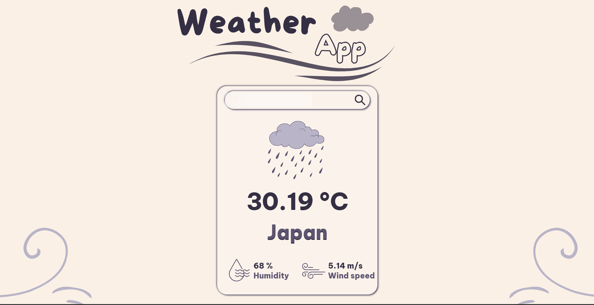

# 🌦️ Weather App

A simple and responsive **Weather App** built with **HTML, CSS, and JavaScript**.  
It allows users to search for a city and instantly get real-time weather information such as temperature, humidity, wind speed, and weather conditions.

---

## 🚀 Features

- 🔎 Search weather by city name  
- 🌡️ Displays temperature, humidity, and wind speed  
- ⛅ Shows weather conditions with icons (sun, rain, mist, etc.)  
- 📱 Fully responsive UI (works on desktop & mobile)  
- ⚡ Fast and lightweight (no frameworks needed)  

---

## 🖼️ Preview

  

---

## 🛠️ Tech Stack

- **HTML5** – for structure  
- **CSS3** – for styling and responsiveness  
- **JavaScript (ES6+)** – for API calls & interactivity  
- **[OpenWeatherMap API](https://openweathermap.org/api)** (or your chosen API) – for live weather data  

---

## 📂 Project Structure
weather-app/
- │── imgs/ # Weather icons (sun, rain, mist, etc.)
- │── index.html # Main HTML file
- │── style.css # Styling
- │── script.js # Logic & API handling
- └── README.md # Project documentation
